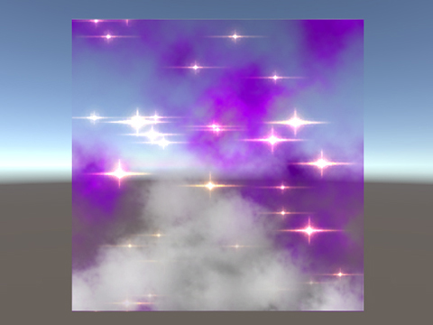
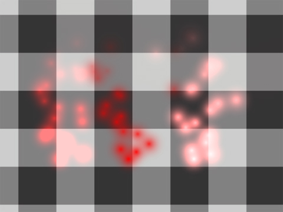
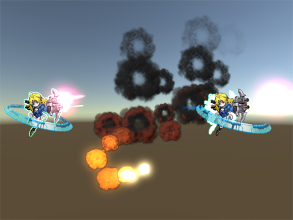
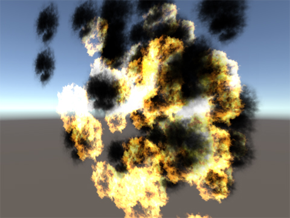
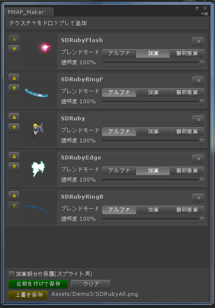

# P-MAP Sample  
CEDEC2015 「加算合成コストが0になる!?　すぐに使えるP-MAPブレンドテクニック」で使用したUnity用プロジェクトです。  
P-MAPの応用例を説明するための4つのデモとP-MAPテクスチャ合成ツール「PMAP_Maker」が入っています。  
Unit5.1.1(64bit) Windows7での動作を確認しています。

Demo1・2はP-MAPのテクニックをシェーダーを使って応用した例です  
Demo3・4はP-MAPのテクニックをテクスチャを使って応用した例です  

### Demo1 (P-MAPシェーダデモ1)
加算・アルファ合成両方を含むマルチテクスチャシェーダの例です。

  

##### Demo1>Demo1.unity
このデモでは1枚のメッシュを使い4枚のストレートアルファ画像をマルチテクスチャで描画しています。  

1.別々にスクロールする2枚の紫の霧  
2.星（加算）  
3.煙  

星（加算）はフレームバッファに対して加算を行うため一般的にはブレンド係数を変えて複数回描画を行う必要がありますが、
P-MAPを取り入れたシェーダを作れば一度の描画で済ませる事ができます。  

※ 描画面積の多いカードゲーム等の表現力向上、ポストエフェクトの描画速度の改善といった場面で役に立つと思います。

### Demo2 (P-MAPシェーダデモ2)
加算合成とアルファ合成、どちらの表現もできる汎用シェーダのデモです。

  

##### Demo2>Demo2.unity
<!--真っ白なRGBに光源っぽいαを持つストレートアルファ画像をパーティクルで飛ばしています。  -->
3つ並んだ同じ素材パーティクルは左から順に、
- 赤く変調した加算合成 （背景が明るい場所で白飛びしています）  
- 赤く変調したアルファ合成 （どこでも綺麗赤く見えますが眩しさがあまり感じられません)  
- 赤く変調したアルファ合成の後、白く加算合成	(中央に白い芯があり、背景が明るくても白飛びしない)  

これらは一般的にはブレンド係数を変えて描画することが多いですが、全て同じシェーダで描画できています。  
各マテリアルの"Alp Color(RGBA)"と"Add Color(RGB)"を調整することで複雑な合成が行えます。

※ このようなシェーダがあれば加算とアルファ合成のためにシェーダーを使い分ける必要が無くなります。  
※ 一番右のようなパーティクルを表示しようとすると従来2パス以上かかりますが1パスで複雑な絵が出せるようになります。  
※ 色違いエフェクト素材を用意する必要が減ります。  
※ ストレート画像をそのまま利用できます。  

```cs
fixed4 _AlpColor;
fixed4 _AddColor;
v2f vert(appdata_t IN)
{
	v2f OUT;
	OUT.vertex = mul(UNITY_MATRIX_MVP, IN.vertex);
	OUT.texcoord = IN.texcoord;
	OUT.color = IN.color * _AlpColor;
	OUT.color.rgb *= OUT.color.a;		//事前乗算
	OUT.color.rgb += IN.color.rgb * _AddColor.rgb * IN.color.a;	//加算成分追加
	#ifdef PIXELSNAP_ON
	OUT.vertex = UnityPixelSnap (OUT.vertex);
	#endif
	return OUT;
}
fixed4 frag(v2f IN) : SV_Target
{
	fixed4 tex = tex2D(_MainTex, IN.texcoord);
	tex.rgb *= tex.a;
	return tex * IN.color;
}
```
今回のデモではマテリアルパラメータを変更して合成方法を指定しているため、
結局3つのマテリアルインスタンスが必要です。  
使用しているバーテックスシェーダでは最終的に1つのカラーを出力しているだけですので、
ここをCPUで計算し頂点色を使って供給することでシーン内のマテリアルをまとめる事も可能です。  
※Unityの場合SpriteやParticleで頂点色が供給できます。
### Demo3 (P-MAPテクスチャデモ1)
加算・アルファ合成が混在した複数のテクスチャをPMAP_Makerを使い
一枚のP-MAPテクスチャにまとめておいてから表示しています。

  

##### Demo3>Demo3.unity

左に表示されているキャラクターは何枚もテクスチャを用意して複数回描画するのが一般的ですが、
実際には一枚の事前乗算アルファテクスチャを一度で描画できています。  

中央のパーティクルでは、爆発パターンの前半に加算のブルームが合成されています。

※ 従来2パス以上かかっていた描画が1パスで出来るようになりました。  
※ αムービもこの手法で事前合成すれば加算を含めたムービーが作れます。  


###  Demo4 (P-MAPテクスチャデモ2)
P-MAPテクスチャを使ってシーン内のドローコールを減らすデモです。

  


##### Demo4>Demo4_Straight.unity
こちらが今までの一般的なストレート画像を使ったシーンです。  
シーン内で100枚のスプライトが表示されていますが、
加算とアルファ用のマテリアルが混在するため50回近いドローコールが発生しています。

##### Demo4>Demo4_PMAP.unity
Demo3と仕組みは同じですがP-MAPテクスチャを使えばテクスチャ領域毎に加算・アルファ合成を指定できますので
シーン内のマテリアルが一つになり1度のドローコールにまとまりました。
実際にはDemo3よりもこのような用途で使われることのほうが多いと思います。


##  PMAP_Maker
Unity上で加算・アルファ合成が混在した複数のストレートアルファテクスチャを
事前乗算アルファ形式のテクスチャ一枚にまとめるツールです。

  
メニュー>PMAP>PMAP_Makerで起動します  

[加算部分の保護] Unityではスプライト化した時最適化が働き、アルファが０のピクセルをなるべく取り除いたメッシュに変換されます、
そのためP-MAPテクスチャの加算部分が表示されなくなってしまいます。  
このスイッチは最終的に加算のみとなったピクセルのアルファが通常０になるところを(1/255)に上書きします。
その結果メッシュ化の対象になりますが、ほんの少し描画先の色が暗くなってしまいます。

※このツールではリニアワークフローに関して考慮していません。


##  補足
「P-MAPシェーダ」「P-MAPテクスチャ」はどちらも出力直前までは浮動少数で合成されるため、
普通に何度も整数フレームバッファに描画した場合より精度の向上が期待できます。  
